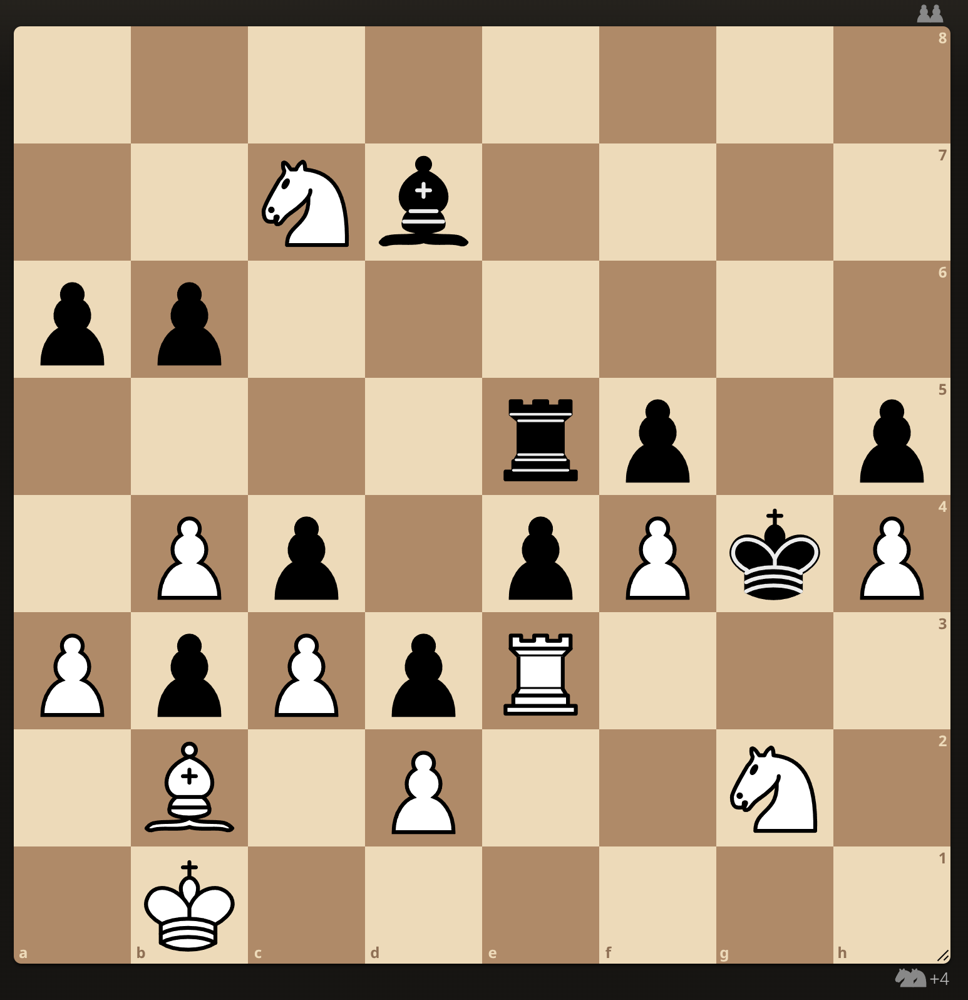

# Resampled Importance Sampling is All You Need

## Authors
Andrew Peterson

## Abstract

We present Resampled Importance Sampling for Large Language Models (RIS), a novel method to improve efficiency for test-time inference. Resampled Importance Sampling, a technique from the field of computer graphics, allows for massive reuse across a single Tree of Thought allowing LLMs to search deeper, discover more important lines of reasoning, and enables new forms of compositionality.

Our experiments show that RIS significantly enhances language model's problem-sovling abilities on three benchmarks: MMLU, MATH-500, and ARC-AGI 2. RIS does not require any retraining or fine-tuning, and this paper comes with an open source repository with compatibility with HuggingFace Transformers.


What if we combined Resampled Importance Sampling with Large Language Models using Tree of Thought?


Current Large Language Models use naive versions of sampling and search where an assumption is made that different branches of the same tree of thought are completely independent.

To make the problem apparent, consider the following mate-in-5 chess puzzle:

```
8/2Nb4/pp6/4rp1p/1Pp1pPkP/PpPpR3/1B1P2N1/1K6 w - - 0 1
```



Even on max settings on lichess.org with Stockfish 16 (NNUE) it struggles at first to find a guaranteed mate, and then even more to find the mate in 5. Less sophisticated chess engines can find the mate quickly because they perform a dumber, more brute-force search, and Stockfish 17 can find it realtively quickly based on having a larger NNUE.

Example on how mixing at different levels can produce better outcome

Question: "What is the capital of France?"

Completion 1: "**The largest city in France is the capital.** _Marseille is the largest city in France._ Marseille is the capital of France."

Completion 2: "_The largest city in France is not the capital._ **Paris is the largest city in France.** Marseille is the capital of France."

Correct completion: "The largest city in France is the capital. Paris is the largest city in France. Paris is the capital of France."

[1] Tree of Thought https://arxiv.org/abs/2305.10601
